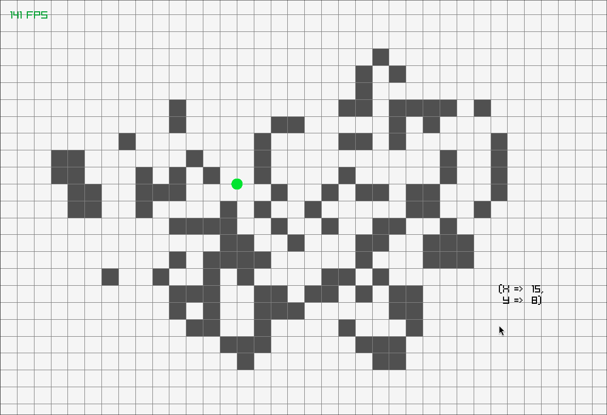

# GOL-Ada

Graphical Conway's Game of Life implementation in Ada with Raylib
With planned support for other outer-totalistic cellular automata rules.

[]

## References
- Fabulous Adventures in Coding: https://ericlippert.com/2020/04/13/life-part-1/
- Hashlife: https://conwaylife.com/wiki/HashLife
- Alan Hensel's Description: https://www.ibiblio.org/lifepatterns/lifeapplet.html
- Golly Help: Quicklife: https://golly.sourceforge.io/Help/Algorithms/QuickLife.html
- Raylib Examples: https://www.raylib.com/examples.html
